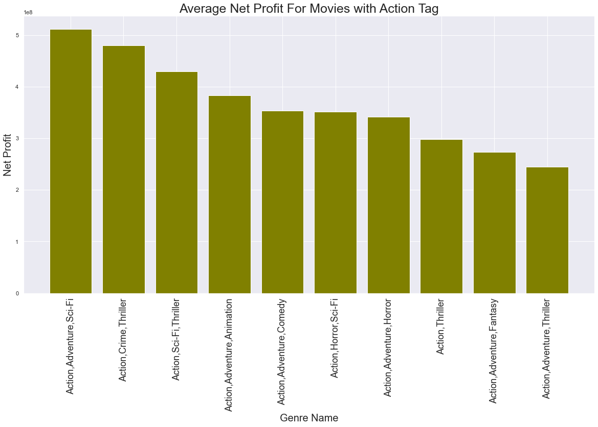
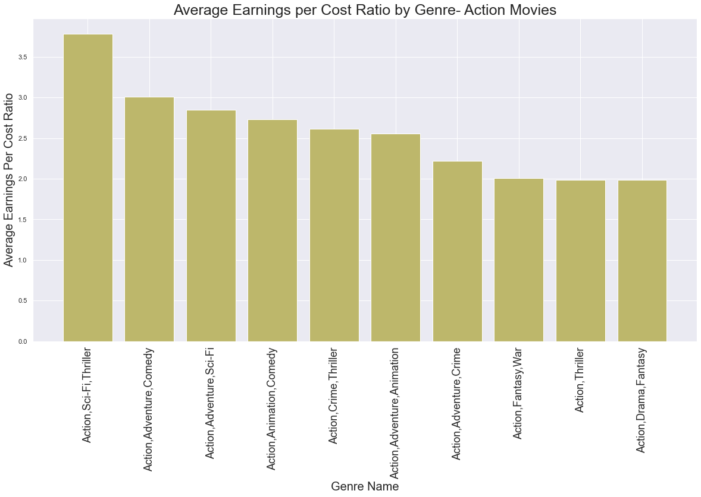
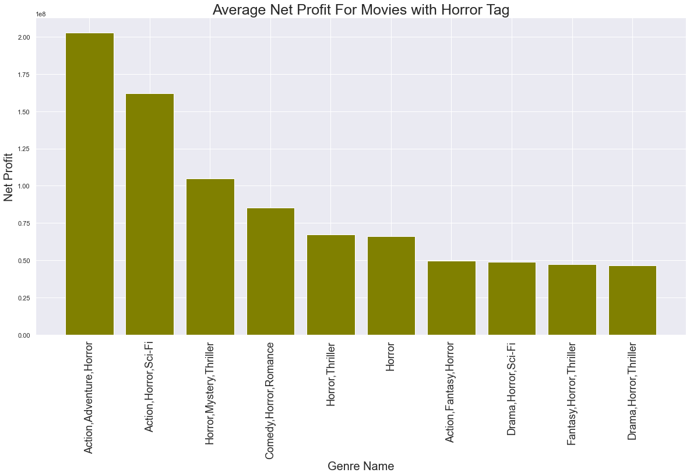
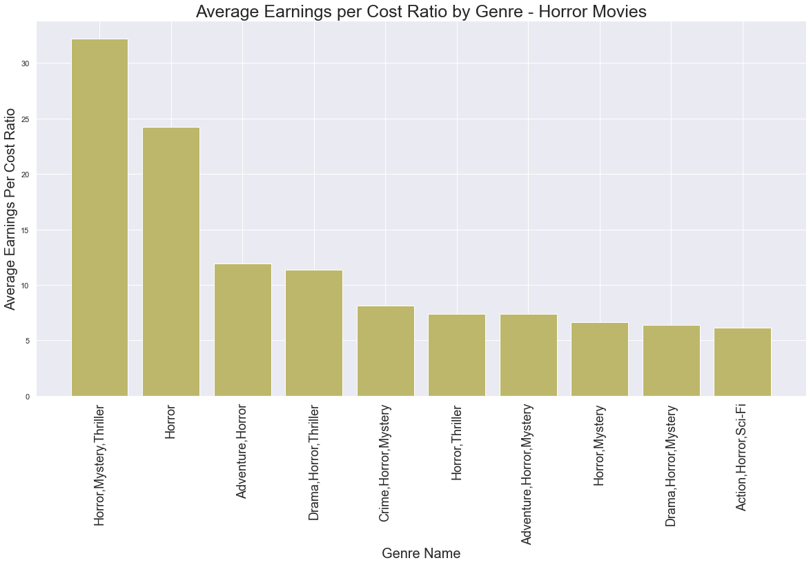
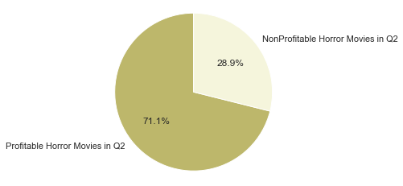

# Microsoft Movie Analysis 

Authors: Emma Choate, Bobby Oliver

## Overview
In this repository we worked to address the task of recommending to Microsoft what kind of movie they should make if they were to expand into the film industry. We examined the financial data of movies released after 2010, in order for our recommendation to be up to date, in respect to the genres of movies in order to best present to the company what type of movie would be most successful for them to make. After collecting, examining and graphing our data we came to the conclusion that Horror movies and Action movies have the greatest potential for success, and found there to be subgenres within that were the most lucrative. Inside the repository, we stored our code within the data/zippedData folder, residing in files named Microsoft Movie Analysis.ipynb, Other Data.ipynb, and Project 1 Data.ipynb. We also stored our visualizations/graphs within the Visualizations folder. 

## Business Problem
Microsoft wants to figure out the best approach to the movie industry. This left us with some key questions. How do we deem a movie successful? Within the genres, are there specific tags to hit for a successful movie? What parameters do we set? When approaching this, we decided to use net profit and earnings per cost ratio to help answer these questions. After some research we deemed a successful movie to be one that earned twice its production budget(https://www.fool.com/investing/2019/08/06/why-box-office-results-dont-really-explain-how-mov.aspx#:~:text=But%20it's%20important%20to%20remember,the%20movie%20but%20marketing%20it.). The Net Profits (before marketing) takes the world wide gross income and subtracts the budget of the movie. This creates a value for net profit(we are under the assumption that production budget does not include marketing costs). Taking this net profit and dividing it by the budget gives us the earnings per cost ratio. This ratio takes into account the lack of marketing data to determine how profitable a film really is. An earnings per cost ratio of one means that the movie has made back twice its production budget and thus any E/C ratio over one is a profitable movie. We then began to look at movies by their genres in order to recommend to Microsoft the genres that managed to return the highest net profits and had the highest Earnings per cost ratio. We neglected to look at critical reception of the films, instead using purely financial criteria as we feel Microsoft would rather have a film that made them money rather than one that wins them awards.

## Data
In terms of the data we used to draw our conclusions, we used data frames containing basic information on and ratings of movies from IMDB (Internet Movie Database)and financial data regarding a movie's budget and gross from The Numbers(another internet movie databases). We condensed this data into a massive table that we affectionately referred to as mega table due to its large size and volume of data, containing the information of 1910 Films. The data consists of The titles of movies along with their release date, corresponding financial data, IMDB ratings and review counts, and genre. We used a value called tconstant to merge all of this data, as it came from three separate tables. Our mega table and mega table 2 consist of a cumulative list of all movies in the database that had all of the data. As previously stated, the main variables from this table we thought would measure the type of movie microsoft would create were net profit prior to marketing and earning to cost ratio, when looking at broader genres and more specific subgenres within them.

## Methods
In terms of how we prepared and analyzed our data, we spent much of our time finding effective ways to look at specific segments of the data. We narrowed down the data to movies that were made from 2010 onwards so that we could see the most recent trends in per genre movie success and modern budgetary and earning data. We also used the number of votes from our imdb rating information to factor out any film that we deemed insignificant (assuming that films made by big studios or of any note would have a certain amount of reviews). We made modifications to this data such as creating the earnings per cost ratio and net profit pre-marketing columns, among others, in order to more accurately analyze them. 
We then analyzed the data split into 3 different periods of the year that were four month intervals, with each period containing the first, second, and third groups of four months throughout the year, and only containing the top 20 most prevalent genres during that period in order to make the data more manageable. Another way we classified them was by filtering to look at specific broad genres, creating dataframes that looked at all of the films with subgenres that contained the Horror or action classifications. We then used summary statistics, specifically range and mean, in order to examine the earnings per cost ratio, net profit and budget. we then organized this information into a multitude of visualizations by way of bar graph, scatter plots and pie charts to better understand and present our findings.

## Results
Our findings showed that the subgenres that fell into the broader action and horror categories tended to have the highest net profit, for action, and earnings per cost ratio, for both but specifically horror. Out of the 198 action films that were in our action table, that had over 10,000 IMDB votes,  we found them to have an average E/C ratio of 2.03 and median ratio of 1.67. Dividing the number of action movies with an EC over one by the total number yielded a profitability rate of roughly 67%, meaning that roughly two thirds of movies with action in the genre made back double their production budget.  Those numbers already show that these types of movies generally turn a profit, but on average do not have crazy return ratios. They fail to capture that the the average production budget of them was $145,031,313.13 meaning that when their EC ratio was over the profitability they brought in extremely large amounts of money as net profit, reflected by their mean net profit of $310,686,280.28. This astronomic amount of profit is even larger when looking at The Action, Adventure, Sci-Fi subgenre. This Subgenre  made an average net profit of a ridiculous $511,433,347.80 on average, it contains movies such as the avengers franchise or jurassic world, think big budget blockbuster type movies.

The horror genre may not have as high net profits on average, with  mean and median net profits of $60,541,549.28 and $29,065,832.00, respectively, but the 162 films in this genre tend to have excellent return on investment, represented through E/C ratio. The mean E/C ratio for this genre is a whopping 10.48. While this value is inflated by some almost mind blowingly profitable movies, the median value is still 2.31, with a ¾ quartile value of 8.41, showing that this value is not solely bolstered by only a few outliers and instead contains many highly profitable movies. Thus, due to their highly profitable nature and much lower budgetary constraints, Microsoft could begin to pump out horror movies at a low budget and collect steady profit, with the highest chance of profiting occurring in the $4 mil- $9.45 mil budget range, where they have an E/C over 2 roughly 71% of the time.  Within Horror, the best subgenre for the highest EC ratio is the Horror, Mystery, Thriller genre, which has an average EC of about 32.19.

## Recommendation
As is evident, one of the best ways to make large profits off of movies is through a successful franchise. Film series like the Marvel Cinematic Universe and Paranormal Activity consistently produce movies that do extremely well in the box office. We feel that the best way for Microsoft to emulate this success is to attempt to kickstart a franchise that aligns with the most successful genre types and has the source material for many films down the line. We felt that the perfect source material for this would be the Halo universe. It already has a loyal following, is still relevant in pop culture and fits snugly into the action,adventure,sci fi genre. We feel that if Microsoft made a well executed Halo movie then they would be able to continue to produce these films and rake in huge profits for years to come.

